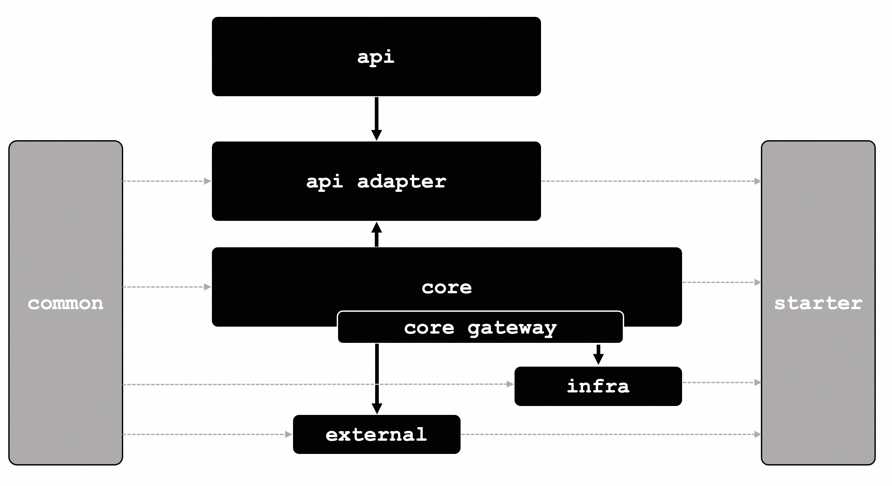

# Halo


## 这个项目模板\[template\] \[boilerplate\]提供什么能力？
1. 提供一个基础项目，快速开启一个spring-boot/helidon/quarkus/micronaut项目
2. 一个合理的久经考验的项目module和包接口，这个结构符合DDD最佳实践
3. 提供基础的命名约束规范要求，减少可能存在的沟通歧义
4. 提供大量提升开发体验的能力，如lombok，mapstruct，slf4j等
5. 提供强制的代码风格检查&PMD基础错误检查，并配合git hooks消除潜在基础错误
6. 许多符合现代最佳实践的工具类

## QUICK START
*由于现在archetype还没有发布到maven中央仓库，所以可以按照本地安装流程使用
```shell
# clone git repository
git clone https://github.com/open-halo/halo-starter.git

# install archetype to local
cd halo-starter/archetypes/spring-boot-maven && mvn install

# generate new project from archetype
cd ~/your-awesome-projext-dir
mvn archetype:generate -DarchetypeCatalog=local
```

## 这个项目模板\[template\] \[boilerplate\]的核心设计理念是什么？
这个项目的核心设计理念是：追求软件工程的「外延灵活性」和「内核确定性」
1. 「外延灵活性」是指软件可能适应不同的外在环境，例如允许项目在spring boot/quarkus \
之间灵活切换，在MySql和PostgreSQL之间切换，在RockerMQ和Kafka之间灵活切换。这种隔离性 \
不仅仅是为了应对潜在的变化，更加会促使开发者把真正的业务逻辑沉淀到核心层。
2. 「内核确定性」是指我们希望软件最内核的逻辑是相对稳定的，只有这部分的相对稳定，可测，才能\
保证项目的持续稳定性。我们希望通过DDD把原来隐性的概念，全部转化为领域建模，沉淀在内核之中。

## 为什么强制使用DDD风格，这个风格对于小型项目是否过重？
我们坚定地认可以下3条价值观：
1. 多几个层次划分，让文件和class的位置清晰固定，比节省一个包/目录层次重要
2. 多几行代码把「变量」「函数」「对象」定义出来，让逻辑变得明确，比节省几行代码重要  
3. module之间的强制隔离，能减少很多逻辑层次的划分不明确导致的代码混乱  
如果我们认可以上价值，我们不会认为多分了几个层，多分了几个包就是重。
我们认为有序的层次，远远好于无序的平铺。


## 整体的模块如下：

1. api: 接口层，纯定义interface和object，无逻辑，因为需要注解，弱依赖于spring boot
2. api-adapter: 适配层，接口实现module，包含简单实现，核心逻辑转发到core service layer
3. core: 核心逻辑实现层， 纯代码逻辑，整个工程的核心
4. infra: 基础设置层
5. external: 防腐层，外部调用必须经过防腐层才内被内部调用
6. common: 工具层，纯函数的工具类，可以一些外部工具库
7. starter: 启动module，配置文件集中在这里

## 整体的modules依赖关系强制如下
1. api: 无依赖，因为其他方可能导入，依赖越少越好，避免库污染
2. common: 纯工具，不依赖其他任何module，可以二次封装一些库，可以被除api以外所有模块依赖
3. api-adapter: 依赖于api, core, common
4. external: 只依赖于common和一些外部sdk或者三方jar
5. infra: 依赖于common + core，引入core的gateway，然后实现gateway中的interface
6. core: 依赖于common，其余无依赖，这里依赖倒置
7. starter: 依赖所有module


## TODO list
- [] 添加DAL层示例 
- [] 添加PMD代码检查 
- [x] 添加git提交钩子，强制PMD检查
- [x] 添加格式化工具，提交前自动格式化
- [] 添加slf4j + logback的全套配置
- [] 添加基础工具类
- [] 添加统一拦截器
- [] 添加spring doc实现

## LICENSE
Apache

